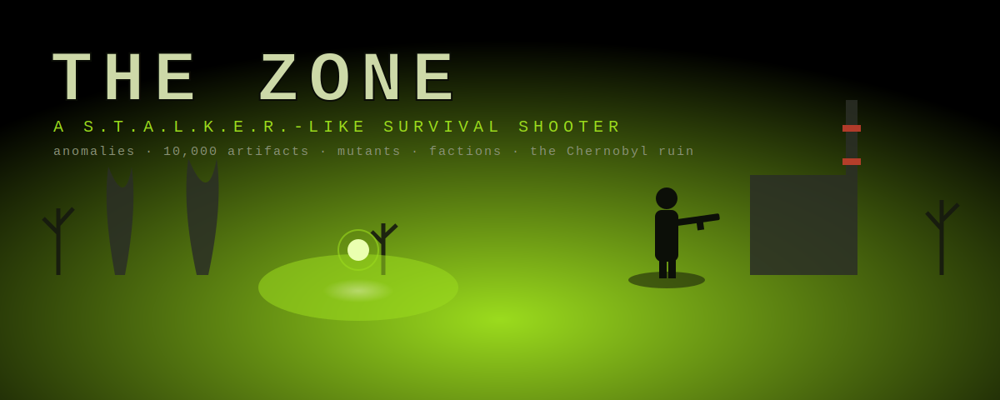

# THE ZONE — a S.T.A.L.K.E.R.-like

### ▶ [**Play now in your browser**](https://andrewvbro.github.io/zone-stalker/) &nbsp;·&nbsp; ⬇ [**Download (.zip)**](https://github.com/andrewvbro/zone-stalker/releases/latest)

> Tip: in Chrome/Edge/Android, open the Play link and choose **Install** to run it as a fullscreen, offline app.

A single-file, browser-based first-person survival shooter set in an irradiated exclusion zone. Built with [Three.js](https://threejs.org/) (no build step — it's one `index.html`).

## ▶ Play

- **Online:** enable GitHub Pages on this repo, then open the Pages URL.
- **Locally:** serve the folder and open it, e.g. `npx serve .` then visit the printed URL. (Opening `index.html` directly via `file://` won't work — it needs http.)
- **Install as an app:** it's a PWA — open it in Chrome/Edge/Android and choose **Install** to run it fullscreen and offline.

## Features

- Atmospheric Zone with rolling terrain, fog, day-gloom lighting, and a Chernobyl-themed second zone (reactor, cooling towers, Pripyat blocks, ferris wheel).
- 10 weapons (pistol → gauss rifle), aim-down-sights, a scoped sniper, buyable attachments installed at a gun bench, and reload/walk animations.
- Artifact detectors (3 tiers) that reveal **10,000** procedurally-generated artifacts hidden in anomalies; equip them on an armor belt for buffs.
- Anomalies (burner / electro / vortex / chemical), emissions/blowouts, mutants (incl. invisible ghouls), bandit & Monolith camps, a military checkpoint, and recruitable stalker allies with faction warfare.
- Trader economy, quests + PDA mission log & bestiary, armor tiers, NVG, gas mask, grenades, death stashes you can recover, and zone-to-zone progression.

## Controls

WASD move · Mouse look · Shift sprint · Ctrl/C crouch · Q/E lean · L-Click shoot · R-Click aim · R reload · 1–0 / wheel weapon · F use/talk/recruit · T detector · L flashlight · G grenade · N NVG · X gas mask · M map · P PDA · Tab/I inventory.

## Controls — cheats

`-` +10,000,000 RU · `+` grant all legendary artifacts.

---

Made for fun. Not affiliated with the S.T.A.L.K.E.R. games.
